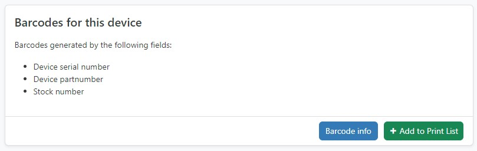
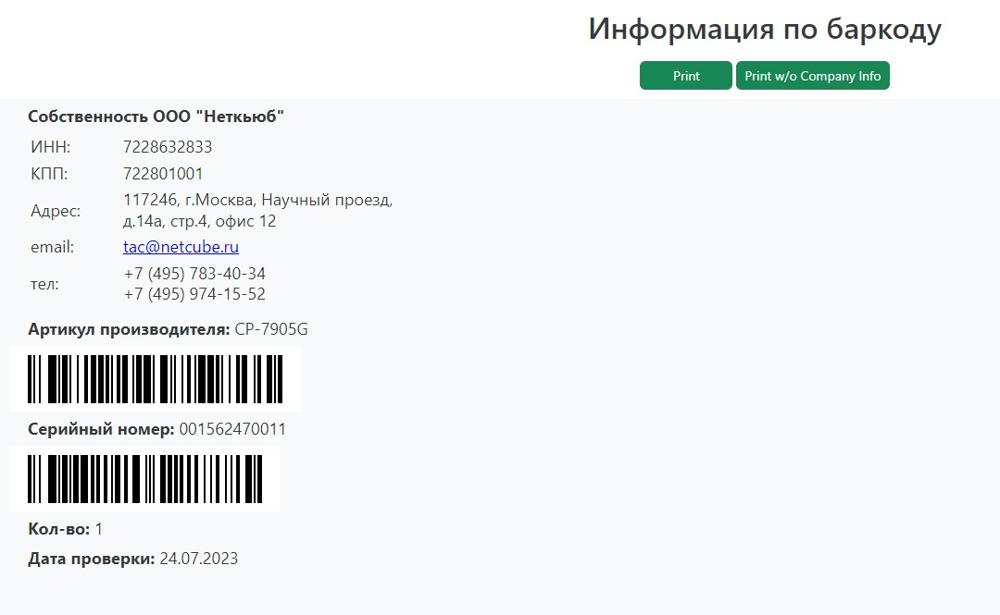

# netbox-barcode
Плагин генерации штрихкодов для netbox

## Короткое описание

Данный плагин добавляет функционал автоматической генерации штрихкодов для устройств netbox (dcim.Devices). 
Штрихкод генерируется по информации из полей устроства: 
- серийный номер;
- складской номер (дополнительное кастомное поле netbox);
- партномер устройства.

`Проверен на netbox версии 3.3.5 и выше`

## Скриншоты




## Установка плагина

1. Клонируйте репозиторий на сервер с установленным netbox
```
	cd /
	git clone https://github.com/aakozlov85/netbox-barcode.git
```
2. Активируйте виртуальное окружение и установите зависимости из requirements_barcode.txt
```
	source /opt/netbox/venv/bin/activate
	pip install -r /netbox-barcode/requirements_barcode.txt
```
3. Установите плагин
```
	cd /netbox-barcode
	python3 setup.py install
```
4.  Скорректируйте секцию PLUGINS в файле конфигураций configuration.py и включите режим разработчика для выполнения миграций.
`
nano /opt/netbox/netbox/netbox/configuration.py
`
```
PLUGINS = ['netbox_barcode',]
DEVELOPER=True
```
5. Создайте и выполните миграции
```
cd /opt/netbox/netbox/
python3 manage.py makemigrations netbox_barcode
python3 manage.py migrate
```
6. Отключите режим разработчика (удаляем DEVELOPER из configuration.py)
7. Выполните сбор статичных файлов
`python3 manage.py collectstatic`
8.  перезапустите Gunicorn WSGI
```
systemctl restart netbox netbox-rq
systemctl status netbox netbox-rq
```
9. Добавьте в Netbox кастомное поле для dcim.devices (Other - Custom Fields)
```
Name - Stock_number
Label - Складской номер
Type - Text
Description - Складской номер для отдела логистики
Required - False
```

### Кастомизация информации

Данные по компании могут быть изменены в шаблоне company_info.html.

